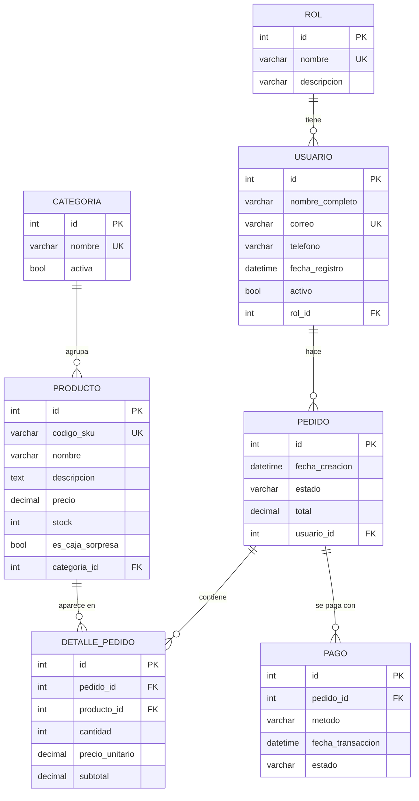

# Guía Evaluación 2: Django Admin (Sinewave)

Esta guía explica qué se hizo, dónde está cada cosa y cómo mostrarlo. Está ordenada igual que los puntos de la pauta.

---

## 0. Cómo levantar el proyecto (desde cero)

```bash
python -m venv .venv
source .venv/bin/activate          # en Windows: .venv\Scripts\activate
pip install -r requirements.txt    # instala Django y Faker
python manage.py migrate           # crea las tablas
python manage.py createsuperuser   # crea el usuario para entrar al admin
python manage.py poblar_datos 100  # carga 100 datos de prueba
python manage.py runserver
```

Luego abre http://localhost:8000/admin/

---

## 1. Configuración de la base de datos

**Dónde:** [sinewave/settings.py](sinewave/settings.py), en la variable `DATABASES`.

```python
DATABASES = {
    'default': {
        'ENGINE': 'django.db.backends.sqlite3',   # qué motor de BD se usa
        'NAME': BASE_DIR / 'db.sqlite3',          # dónde está la BD
    }
}
```

- **¿Qué BD usamos?** SQLite. Es un solo archivo (`db.sqlite3`) en la raíz del proyecto y no necesita instalar un servidor.
- En el mismo archivo, debajo, hay un ejemplo comentado de cómo sería con PostgreSQL: solo cambian `ENGINE`, nombre, usuario, clave, host y puerto.

**Cómo verificar la conexión:**

```bash
python manage.py check          # revisa que la configuración esté bien
python manage.py dbshell        # abre la consola de la BD (si sqlite3 está instalado)
python manage.py showmigrations # si lista las migraciones, Django está leyendo la BD
```

Desde el shell de Django:

```bash
python manage.py shell
>>> from django.db import connection
>>> connection.vendor                    # 'sqlite'
>>> connection.settings_dict['NAME']     # ruta del archivo de la BD
```

También se cambió el idioma a español (`LANGUAGE_CODE = 'es-cl'`) y la zona horaria a Chile (`TIME_ZONE = 'America/Santiago'`), por eso el admin aparece en español.

---

## 2. Modelos

**Dónde:** [tienda/models.py](tienda/models.py)

Un **modelo** es una clase de Python que representa una **tabla**. Cada atributo es una **columna**.

| Modelo | Para qué sirve |
|---|---|
| `Rol` | Tipo de usuario (Cliente, Vendedor, Administrador) |
| `Usuario` | Clientes de la tienda |
| `Categoria` | Guitarras, Bajos, Pianos... |
| `Producto` | Lo que se vende |
| `Pedido` | Una compra de un usuario |
| `DetallePedido` | Cada línea del pedido (producto, cantidad, precio) |
| `Pago` | El pago de un pedido |

### Tipos de datos usados

| Campo Django | Tipo en la BD | Ejemplo |
|---|---|---|
| `CharField(max_length=...)` | VARCHAR | nombre, teléfono |
| `TextField` | TEXT (sin límite) | descripción |
| `EmailField` | VARCHAR, pero valida que sea un correo | correo |
| `DecimalField` | DECIMAL | precio, total |
| `PositiveIntegerField` | INT (no negativo) | stock, cantidad |
| `BooleanField` | BOOLEAN | activo, es_caja_sorpresa |
| `DateTimeField` | DATETIME | fecha_creacion |
| `ForeignKey` | INT + clave foránea | rol, categoria, usuario... |

### Opciones importantes

- `unique=True`: no se puede repetir (correo, SKU).
- `blank=True`: el campo puede quedar vacío en los formularios.
- `default=...`: valor por defecto.
- `choices=...`: solo permite ciertos valores (ej: estado del pedido). En el admin aparece como lista desplegable.
- `db_index=True`: crea un índice para que buscar u ordenar por ese campo sea rápido.

### Relaciones (ForeignKey)

Todas las relaciones son **uno a muchos (1:N)**:

- Un **Rol** tiene muchos **Usuarios**
- Un **Usuario** tiene muchos **Pedidos**
- Una **Categoría** tiene muchos **Productos**
- Un **Pedido** tiene muchos **Detalles** y muchos **Pagos**
- Un **Producto** aparece en muchos **Detalles**

La `ForeignKey` siempre va en el lado "muchos". Por ejemplo, `Pedido` tiene `usuario = ForeignKey(Usuario)`.

`on_delete` define qué pasa si se borra el "padre":
- `CASCADE`: borra también los hijos (si borro un pedido, se borran sus detalles y pagos).
- `PROTECT`: no deja borrar el padre si tiene hijos (no puedo borrar una categoría que tiene productos).

---

## 3. Diagrama de la base de datos



> En VS Code se ve con la vista previa de Markdown (si no aparece, instala la extensión "Markdown Preview Mermaid Support"). En GitHub se ve directamente.

**Cómo leerlo:** `PK` = clave primaria, `FK` = clave foránea, `UK` = único. La línea `||--o{` significa "uno a muchos".

**Nombres reales de las tablas:** Django las nombra `app_modelo`, por ejemplo `tienda_usuario`, `tienda_detallepedido`.

### Cambios respecto al diagrama original (y por qué)

1. **No se escribe el `id`**: Django crea solo la clave primaria `id` en cada modelo (es un entero autoincremental; técnicamente `bigint`).
2. **Las FK se escriben sin `_id`**: en el modelo se pone `usuario = ForeignKey(Usuario)` y Django crea la columna `usuario_id`. Ya no hace falta escribir `FOREIGN KEY ... REFERENCES ...`.
3. **`Rol_Usuario` → `Rol`**, **`Detalle_Carrito` → `DetallePedido`**: en Django los modelos se nombran en singular y en CamelCase. Además el detalle pertenece al pedido, no al carrito.
4. **Se quitó `contrasena` de Usuario**: guardar contraseñas en texto plano es inseguro. Django ya tiene su propio sistema de usuarios (`django.contrib.auth`) que guarda las contraseñas encriptadas, y es el que se usa para entrar al admin. Nuestro `Usuario` representa a los clientes de la tienda.
5. **`estado_general` → `estado`**, **`metodo_pago` → `metodo`**: ahora tienen `choices` (valores fijos).
6. **`subtotal` se calcula solo**: en `DetallePedido.save()` se hace `cantidad * precio_unitario`, y el `total` del pedido se recalcula en el admin.
7. **Se agregaron** `fecha_registro` y `activo` a Usuario (como ejemplo de una modificación con su propia migración).

---

## 4. Migraciones

Una **migración** es un archivo que guarda un cambio en la estructura de la BD (crear una tabla, agregar una columna...). Es como un "historial de commits" de la base de datos.

**Dónde:** [tienda/migrations/](tienda/migrations/)

| Migración | Qué hizo |
|---|---|
| `0001_initial.py` | Creó todas las tablas |
| `0002_usuario_fecha_registro_activo.py` | Agregó `fecha_registro` y `activo` a Usuario |
| `0003_indices_fechas.py` | Agregó índices a las fechas para que el admin sea rápido con 1 millón de datos |

### Comandos

```bash
python manage.py makemigrations    # 1) Lee models.py y GENERA el archivo de migración
python manage.py migrate           # 2) APLICA las migraciones a la BD (crea/cambia tablas)
python manage.py showmigrations    # ver el historial: [X] = aplicada, [ ] = pendiente
python manage.py sqlmigrate tienda 0001   # ver el SQL que genera una migración
```

**Diferencia clave:** `makemigrations` crea el archivo, `migrate` cambia la BD.

### Para mostrar una modificación en vivo

1. Agrega un campo en `models.py`, por ejemplo en `Producto`:
   ```python
   marca = models.CharField(max_length=50, blank=True)
   ```
2. `python manage.py makemigrations` → aparece `0004_producto_marca.py`
3. `python manage.py migrate`
4. `python manage.py showmigrations tienda` → se ve la nueva con `[X]`

> Si el campo nuevo es obligatorio, debe tener `default` o `blank=True`/`null=True`. Si no, Django pregunta qué valor ponerle a las filas que ya existen.

---

## 5. Django Admin

**Dónde:** [tienda/admin.py](tienda/admin.py)

Para registrar un modelo se usa `@admin.register(Modelo)` sobre una clase `ModelAdmin`, que dice **cómo** se muestra.

### CRUD

Con solo registrar el modelo, el admin ya permite:
- **Crear**: botón "Añadir"
- **Consultar**: la lista y el detalle de cada registro
- **Modificar**: clic en un registro, cambiar y guardar
- **Eliminar**: dentro del registro, o seleccionando varios en la lista con la acción "Eliminar seleccionados"

### Personalizaciones usadas

| Opción | Qué hace | Ejemplo |
|---|---|---|
| `list_display` | Columnas de la lista | Usuario: nombre, correo, rol... |
| `list_filter` | **Filtros** en la barra derecha | Producto por categoría, Pedido por estado |
| `search_fields` | **Caja de búsqueda** | Usuario por nombre/correo |
| `usuario__correo` | Buscar en un modelo relacionado (con doble guion bajo) | Buscar pedidos por correo del cliente |
| `list_editable` | Editar directo desde la lista | Precio y stock de productos |
| `list_per_page` | Registros por página | 25 |
| `fieldsets` | Agrupa el formulario en secciones | Producto |
| `inlines` | Muestra registros hijos dentro del padre | Detalles y pagos dentro del Pedido |
| `autocomplete_fields` | Buscador en vez de lista desplegable | Elegir usuario en un pedido |
| `readonly_fields` | Campo que se ve pero no se edita | subtotal, total |
| `date_hierarchy` | Navegación por año/mes/día | Pedidos |
| `actions` | Acciones masivas propias | "Marcar como enviado", "Activar usuarios" |
| `list_select_related` | Trae la FK en la misma consulta (más rápido) | Todas las listas |
| `site_header` | Título del admin | "Sinewave Music Pro - Administración" |

**¿Por qué `autocomplete_fields`?** Con 1.000.000 de usuarios, una lista desplegable normal cargaría el millón completo y la página se caería. El autocompletado busca solo lo que escribes.

---

## 6. Datos de prueba con Faker

**Dónde:** [tienda/management/commands/poblar_datos.py](tienda/management/commands/poblar_datos.py)

Es un **comando personalizado** de Django (todo archivo dentro de `management/commands/` se convierte en un comando de `manage.py`).

```bash
python manage.py poblar_datos 100
python manage.py poblar_datos 1000 --limpiar      # --limpiar borra los datos anteriores
python manage.py poblar_datos 100000 --limpiar
python manage.py poblar_datos 1000000 --limpiar
```

El número es la cantidad de **usuarios, productos, pedidos, detalles y pagos** (cada uno). Roles y categorías son fijos.

### Cómo funciona

- `Faker("es_CL")` genera nombres, teléfonos y textos con formato chileno.
- **`bulk_create`**: en vez de hacer 1 INSERT por fila (1 millón de consultas), inserta de a 5.000 filas por consulta. Esa es la clave para que sea rápido.
- **Por lotes**: no se crean el millón de objetos en memoria de una vez, se van creando y guardando de a 5.000.
- `bulk_create` **no llama a `save()`**, por eso el `subtotal` se calcula a mano en el comando.
- El correo y el SKU llevan un número al final para que nunca se repitan (son `unique`).

### Tiempos medidos (SQLite, este computador)

| Cantidad | Tiempo aprox. |
|---|---|
| 100 | < 1 s |
| 1.000 | < 1 s |
| 100.000 | ~25 s |
| 1.000.000 | ~5 min (usa ~900 MB de RAM) |

Con `--limpiar` y un millón de datos ya cargados, el borrado suma ~40 s.

### Cómo comprobar que se guardaron

- En el admin: la lista muestra el total, ej. "1000000 usuarios".
- En el shell:
  ```bash
  python manage.py shell
  >>> from tienda.models import Usuario, Pedido
  >>> Usuario.objects.count()
  >>> Pedido.objects.filter(estado="pagado").count()
  ```
- El mismo comando imprime los totales al terminar.

---

## Preguntas típicas del profe (respuestas cortas)

- **¿Qué es el ORM?** Permite trabajar con la BD usando clases de Python en vez de escribir SQL.
- **¿Qué es una migración?** Un archivo que registra un cambio en la estructura de la BD, para aplicarlo y tener historial.
- **¿Dónde se configura la BD?** En `settings.py`, en `DATABASES`.
- **¿Qué pasa si borro un pedido?** Se borran sus detalles y pagos (`CASCADE`).
- **¿Y si borro una categoría con productos?** No deja (`PROTECT`).
- **¿Por qué es rápida la carga masiva?** `bulk_create` por lotes, en vez de un INSERT por fila.
- **¿Por qué el admin no se cae con 1 millón?** Paginación (25 por página), `autocomplete_fields`, `list_select_related` e índices en las fechas.
- **¿Para qué sirve `__str__`?** Define cómo se muestra el objeto como texto (en el admin y en los desplegables).
