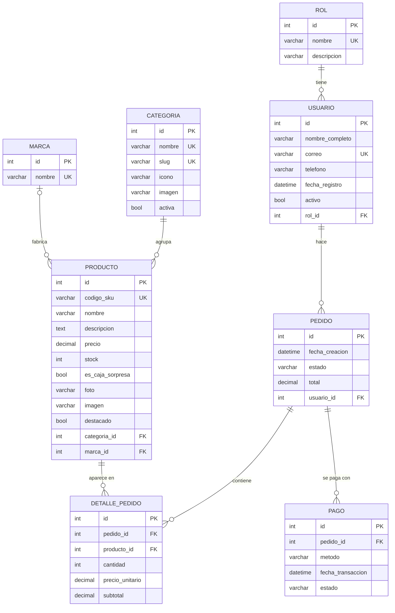

# Guía Evaluación 2: Django Admin (Sinewave)

Esta guía explica qué se hizo, dónde está cada cosa y cómo mostrarlo. Está ordenada igual que los puntos de la pauta.

---

## 0. Cómo levantar el proyecto (desde cero)

```bash
python -m venv .venv
source .venv/bin/activate          # en Windows: .venv\Scripts\activate
pip install -r requirements.txt    # instala Django y Faker
python manage.py migrate           # crea las tablas
python manage.py createsuperuser   # crea el usuario para entrar al admin
python manage.py poblar_datos 100  # carga 100 datos de prueba
python manage.py runserver
```

Luego abre http://localhost:8000/admin/

---

## Estructura del proyecto (qué hace cada carpeta)

Un proyecto Django tiene dos niveles: el **proyecto** (`sinewave/`, la configuración general) y las **apps** (`tienda/`, donde está la lógica). Un proyecto puede tener varias apps; nosotros tenemos una.

```
sinewave/                      ← raíz del repositorio
├── manage.py                  ← "control remoto" de Django: runserver, migrate, makemigrations, poblar_datos...
├── requirements.txt           ← librerías a instalar (Django, Faker, Pillow para las fotos)
├── db.sqlite3                 ← LA BASE DE DATOS (SQLite es un solo archivo)
├── GUIA_EVALUACION.md         ← esta guía
├── diagrama bd.drawio         ← diagrama entidad-relación de la BD
├── diagrama flujo.drawio      ← diagrama de flujo del usuario en la tienda
│
├── sinewave/                  ← CONFIGURACIÓN del proyecto
│   ├── settings.py            ← base de datos, apps instaladas, idioma, zona horaria, static y media
│   ├── urls.py                ← URLs principales: /admin/ y todo lo demás lo manda a tienda/urls.py
│   ├── wsgi.py / asgi.py      ← entrada para servidores de producción (no se tocaron)
│   └── __init__.py            ← marca la carpeta como paquete de Python (vacío)
│
└── tienda/                    ← la APP de la tienda
    ├── models.py              ← MODELOS = tablas de la BD (Rol, Usuario, Categoria, Marca, Producto, Pedido, DetallePedido, Pago)
    ├── admin.py               ← cómo se ve cada modelo en el panel /admin/ (filtros, búsquedas, inlines...)
    ├── views.py               ← VISTAS = funciones que responden a cada URL y eligen qué plantilla mostrar
    ├── urls.py                ← une cada dirección (/carrito/, /categoria/<slug>/...) con su vista
    ├── apps.py                ← configuración de la app (la genera Django)
    ├── tests.py               ← para pruebas automáticas (vacío)
    ├── migrations/            ← historial de cambios de la BD (0001 a 0007), ver sección 4
    ├── management/commands/
    │   └── poblar_datos.py    ← comando propio: python manage.py poblar_datos 100 (sección 6)
    ├── templates/             ← PLANTILLAS HTML (base.html + una por página)
    └── static/                ← archivos fijos: css/style.css e img/ (logos, fotos de productos y categorías)
```

Al ejecutar el proyecto también aparecen `media/` (las fotos que se suben desde el admin) y `.venv/` (el entorno virtual con las librerías). Ninguna de las dos se sube a GitHub (están en `.gitignore`).

### Patrón MVT (Modelo – Vista – Template)

Django sigue el patrón **MVT**:

| Parte | Archivo | Qué hace |
|---|---|---|
| **M**odelo | `models.py` | Define los datos y se comunica con la BD |
| **V**ista | `views.py` | Recibe la petición, consulta los modelos y elige la plantilla |
| **T**emplate | `templates/*.html` | El HTML que ve el usuario, con `{{ variables }}` y `` |

### Qué pasa cuando alguien entra a `/categoria/guitarras/`

1. Django revisa `sinewave/urls.py`, que lo manda a `tienda/urls.py`.
2. `path('categoria/<str:slug>/', views.categoria)` coincide, con `slug = "guitarras"`.
3. `views.categoria` busca la categoría en la BD (`Categoria.objects.get(slug="guitarras")`) y sus productos, de a 12 por página.
4. Hace `render(request, 'categoria.html', {...})` con esos datos.
5. La plantilla `categoria.html` extiende `base.html` (menú y pie de página) y dibuja una tarjeta por producto con ``.

### Qué está en la BD y qué no

- **Sale de la BD:** categorías, productos y marcas de la página de inicio y de cada categoría. También todo lo que se ve en el admin.
- **No usa la BD (funciona con JavaScript en el navegador, `localStorage`):** el carrito, el login, el registro y el checkout. Por eso los usuarios que se registran en la página **no** aparecen en el admin. Pasarlos a la BD sería el siguiente paso del proyecto.

---

## 1. Configuración de la base de datos

**Dónde:** [sinewave/settings.py](sinewave/settings.py), en la variable `DATABASES`.

```python
DATABASES = {
    'default': {
        'ENGINE': 'django.db.backends.sqlite3',   # qué motor de BD se usa
        'NAME': BASE_DIR / 'db.sqlite3',          # dónde está la BD
    }
}
```

- **¿Qué BD usamos?** SQLite. Es un solo archivo (`db.sqlite3`) en la raíz del proyecto y no necesita instalar un servidor.
- En el mismo archivo, debajo, hay un ejemplo comentado de cómo sería con PostgreSQL: solo cambian `ENGINE`, nombre, usuario, clave, host y puerto.

**Cómo verificar la conexión:**

```bash
python manage.py check          # revisa que la configuración esté bien
python manage.py dbshell        # abre la consola de la BD (si sqlite3 está instalado)
python manage.py showmigrations # si lista las migraciones, Django está leyendo la BD
```

Desde el shell de Django:

```bash
python manage.py shell
>>> from django.db import connection
>>> connection.vendor                    # 'sqlite'
>>> connection.settings_dict['NAME']     # ruta del archivo de la BD
```

También se cambió el idioma a español (`LANGUAGE_CODE = 'es-cl'`) y la zona horaria a Chile (`TIME_ZONE = 'America/Santiago'`), por eso el admin aparece en español.

---

## 2. Modelos

**Dónde:** [tienda/models.py](tienda/models.py)

Un **modelo** es una clase de Python que representa una **tabla**. Cada atributo es una **columna**.

| Modelo | Para qué sirve |
|---|---|
| `Rol` | Tipo de usuario (Cliente, Vendedor, Administrador) |
| `Usuario` | Clientes de la tienda |
| `Categoria` | Guitarras, Bajos, Pianos... (con slug para la URL, ícono e imagen) |
| `Marca` | Fender, Yamaha, Roland... |
| `Producto` | Lo que se vende |
| `Pedido` | Una compra de un usuario |
| `DetallePedido` | Cada línea del pedido (producto, cantidad, precio) |
| `Pago` | El pago de un pedido |

### Tipos de datos usados

| Campo Django | Tipo en la BD | Ejemplo |
|---|---|---|
| `CharField(max_length=...)` | VARCHAR | nombre, teléfono, imagen (URL) |
| `ImageField` | VARCHAR con la ruta del archivo (la imagen va a `media/`) | foto del producto |
| `SlugField` | VARCHAR, solo letras, números y guiones | slug de la categoría |
| `TextField` | TEXT (sin límite) | descripción |
| `EmailField` | VARCHAR, pero valida que sea un correo | correo |
| `DecimalField` | DECIMAL | precio, total |
| `PositiveIntegerField` | INT (no negativo) | stock, cantidad |
| `BooleanField` | BOOLEAN | activo, es_caja_sorpresa |
| `DateTimeField` | DATETIME | fecha_creacion |
| `ForeignKey` | INT + clave foránea | rol, categoria, usuario... |

### Opciones importantes

- `unique=True`: no se puede repetir (correo, SKU).
- `blank=True`: el campo puede quedar vacío en los formularios.
- `default=...`: valor por defecto.
- `choices=...`: solo permite ciertos valores (ej: estado del pedido). En el admin aparece como lista desplegable.
- `db_index=True`: crea un índice para que buscar u ordenar por ese campo sea rápido.

### Relaciones (ForeignKey)

Todas las relaciones son **uno a muchos (1:N)**:

- Un **Rol** tiene muchos **Usuarios**
- Un **Usuario** tiene muchos **Pedidos**
- Una **Categoría** tiene muchos **Productos**
- Una **Marca** tiene muchos **Productos** (opcional: `null=True`)
- Un **Pedido** tiene muchos **Detalles** y muchos **Pagos**
- Un **Producto** aparece en muchos **Detalles**

La `ForeignKey` siempre va en el lado "muchos". Por ejemplo, `Pedido` tiene `usuario = ForeignKey(Usuario)`.

`on_delete` define qué pasa si se borra el "padre":
- `CASCADE`: borra también los hijos (si borro un pedido, se borran sus detalles y pagos).
- `PROTECT`: no deja borrar el padre si tiene hijos (no puedo borrar una categoría que tiene productos).

---

## 3. Diagrama de la base de datos



> En VS Code se ve con la vista previa de Markdown (si no aparece, instala la extensión "Markdown Preview Mermaid Support"). En GitHub se ve directamente.

**Cómo leerlo:** `PK` = clave primaria, `FK` = clave foránea, `UK` = único. La línea `||--o{` significa "uno a muchos".

**Nombres reales de las tablas:** Django las nombra `app_modelo`, por ejemplo `tienda_usuario`, `tienda_detallepedido`.

### Cambios respecto al diagrama original (y por qué)

1. **No se escribe el `id`**: Django crea solo la clave primaria `id` en cada modelo (es un entero autoincremental; técnicamente `bigint`).
2. **Las FK se escriben sin `_id`**: en el modelo se pone `usuario = ForeignKey(Usuario)` y Django crea la columna `usuario_id`. Ya no hace falta escribir `FOREIGN KEY ... REFERENCES ...`.
3. **`Rol_Usuario` → `Rol`**, **`Detalle_Carrito` → `DetallePedido`**: en Django los modelos se nombran en singular y en CamelCase. Además el detalle pertenece al pedido, no al carrito.
4. **Se quitó `contrasena` de Usuario**: guardar contraseñas en texto plano es inseguro. Django ya tiene su propio sistema de usuarios (`django.contrib.auth`) que guarda las contraseñas encriptadas, y es el que se usa para entrar al admin. Nuestro `Usuario` representa a los clientes de la tienda.
5. **`estado_general` → `estado`**, **`metodo_pago` → `metodo`**: ahora tienen `choices` (valores fijos).
6. **`subtotal` se calcula solo**: en `DetallePedido.save()` se hace `cantidad * precio_unitario`, y el `total` del pedido se recalcula en el admin.
7. **Se agregaron** `fecha_registro` y `activo` a Usuario (como ejemplo de una modificación con su propia migración).
8. **Se agregó `Marca`** y en Producto `imagen`, `destacado` y `marca`; en Categoría `slug`, `icono` e `imagen`. Así el catálogo de la página (antes escrito a mano en `views.py`) sale de la BD.

---

## 4. Migraciones

Una **migración** es un archivo que guarda un cambio en la estructura de la BD (crear una tabla, agregar una columna...). Es como un "historial de commits" de la base de datos.

**Dónde:** [tienda/migrations/](tienda/migrations/)

| Migración | Qué hizo |
|---|---|
| `0001_initial.py` | Creó todas las tablas |
| `0002_usuario_fecha_registro_activo.py` | Agregó `fecha_registro` y `activo` a Usuario |
| `0003_indices_fechas.py` | Agregó índices a las fechas para que el admin sea rápido con 1 millón de datos |
| `0004_catalogo_campos.py` | Creó `Marca` y agregó imagen, destacado y marca a Producto; slug, ícono e imagen a Categoría |
| `0005_cargar_catalogo.py` | **Migración de datos**: inserta las categorías, marcas y los 23 productos reales de la tienda |
| `0006_categoria_slug_unico.py` | Hace el slug único (se hace después de llenarlo, si no fallaría con slugs vacíos repetidos) |
| `0007_producto_foto.py` | Agregó `foto` (ImageField) para subir fotos desde el admin; se guardan en `media/productos/` |

> **Migración de datos:** no la genera `makemigrations`, se escribe a mano con `RunPython`. Sirve para que al hacer `migrate` en una BD nueva la tienda ya tenga su catálogo.

### Comandos

```bash
python manage.py makemigrations    # 1) Lee models.py y GENERA el archivo de migración
python manage.py migrate           # 2) APLICA las migraciones a la BD (crea/cambia tablas)
python manage.py showmigrations    # ver el historial: [X] = aplicada, [ ] = pendiente
python manage.py sqlmigrate tienda 0001   # ver el SQL que genera una migración
```

**Diferencia clave:** `makemigrations` crea el archivo, `migrate` cambia la BD.

### Para mostrar una modificación en vivo

1. Agrega un campo en `models.py`, por ejemplo en `Producto`:
   ```python
   peso_kg = models.DecimalField(max_digits=5, decimal_places=1, null=True, blank=True)
   ```
2. `python manage.py makemigrations` → aparece `0008_producto_peso_kg.py`
3. `python manage.py migrate`
4. `python manage.py showmigrations tienda` → se ve la nueva con `[X]`

> Si el campo nuevo es obligatorio, debe tener `default` o `blank=True`/`null=True`. Si no, Django pregunta qué valor ponerle a las filas que ya existen.

---

## 5. Django Admin

**Dónde:** [tienda/admin.py](tienda/admin.py)

Para registrar un modelo se usa `@admin.register(Modelo)` sobre una clase `ModelAdmin`, que dice **cómo** se muestra.

### CRUD

Con solo registrar el modelo, el admin ya permite:
- **Crear**: botón "Añadir"
- **Consultar**: la lista y el detalle de cada registro
- **Modificar**: clic en un registro, cambiar y guardar
- **Eliminar**: dentro del registro, o seleccionando varios en la lista con la acción "Eliminar seleccionados"

### Personalizaciones usadas

| Opción | Qué hace | Ejemplo |
|---|---|---|
| `list_display` | Columnas de la lista | Usuario: nombre, correo, rol... |
| `list_filter` | **Filtros** en la barra derecha | Producto por categoría, Pedido por estado |
| `search_fields` | **Caja de búsqueda** | Usuario por nombre/correo |
| `usuario__correo` | Buscar en un modelo relacionado (con doble guion bajo) | Buscar pedidos por correo del cliente |
| `list_editable` | Editar directo desde la lista | Precio y stock de productos |
| `list_per_page` | Registros por página | 25 |
| `fieldsets` | Agrupa el formulario en secciones | Producto |
| `inlines` | Muestra registros hijos dentro del padre | Detalles y pagos dentro del Pedido |
| `autocomplete_fields` | Buscador en vez de lista desplegable | Elegir usuario en un pedido |
| `readonly_fields` | Campo que se ve pero no se edita | subtotal, total |
| `date_hierarchy` | Navegación por año/mes/día | Pedidos |
| `actions` | Acciones masivas propias | "Marcar como enviado", "Activar usuarios" |
| `list_select_related` | Trae la FK en la misma consulta (más rápido) | Todas las listas |
| `site_header` | Título del admin | "Sinewave Music Pro - Administración" |

**¿Por qué `autocomplete_fields`?** Con 1.000.000 de usuarios, una lista desplegable normal cargaría el millón completo y la página se caería. El autocompletado busca solo lo que escribes.

---

## 6. Datos de prueba con Faker

**Dónde:** [tienda/management/commands/poblar_datos.py](tienda/management/commands/poblar_datos.py)

Es un **comando personalizado** de Django (todo archivo dentro de `management/commands/` se convierte en un comando de `manage.py`).

```bash
python manage.py poblar_datos 100
python manage.py poblar_datos 1000 --limpiar      # --limpiar borra los datos anteriores
python manage.py poblar_datos 100000 --limpiar
python manage.py poblar_datos 1000000 --limpiar
```

El número es la cantidad de **usuarios, productos, pedidos, detalles y pagos** (cada uno). Roles, categorías y marcas son fijos.

Los productos de prueba tienen SKU `SKU-...` y no tienen imagen; los reales (migración 0005) tienen SKU `SW-...`. `--limpiar` solo borra los de prueba, así la tienda no se queda sin catálogo. En la página de cada categoría se muestran primero los reales y se pagina de a 12.

### Cómo funciona

- `Faker("es_CL")` genera nombres, teléfonos y textos con formato chileno.
- **`bulk_create`**: en vez de hacer 1 INSERT por fila (1 millón de consultas), inserta de a 5.000 filas por consulta. Esa es la clave para que sea rápido.
- **Por lotes**: no se crean el millón de objetos en memoria de una vez, se van creando y guardando de a 5.000.
- `bulk_create` **no llama a `save()`**, por eso el `subtotal` se calcula a mano en el comando.
- El correo y el SKU llevan un número al final para que nunca se repitan (son `unique`).

### Tiempos medidos (SQLite, este computador)

| Cantidad | Tiempo aprox. |
|---|---|
| 100 | < 1 s |
| 1.000 | < 1 s |
| 100.000 | ~25 s |
| 1.000.000 | ~5 min (usa ~900 MB de RAM) |

Con `--limpiar` y un millón de datos ya cargados, el borrado suma ~40 s.

### Cómo comprobar que se guardaron

- En el admin: la lista muestra el total, ej. "1000000 usuarios".
- En el shell:
  ```bash
  python manage.py shell
  >>> from tienda.models import Usuario, Pedido
  >>> Usuario.objects.count()
  >>> Pedido.objects.filter(estado="pagado").count()
  ```
- El mismo comando imprime los totales al terminar.

---

## Preguntas para la defensa (respuestas cortas)

Ordenadas por tema. Si te preguntan "¿dónde está?", abre el archivo indicado y muestra la línea.

### Django en general

**¿Qué es Django?**
Un framework de Python para hacer aplicaciones web. Trae ORM, panel de administración, sistema de URLs y plantillas.

**¿Qué es el patrón MVT?**
Modelo (`models.py`, los datos), Vista (`views.py`, la lógica) y Template (`templates/`, el HTML). La vista consulta el modelo y le pasa los datos a la plantilla.

**¿Diferencia entre proyecto y app?**
El proyecto (`sinewave/`) es la configuración general. La app (`tienda/`) es un módulo con funcionalidad propia. Un proyecto puede tener varias apps.

**¿Para qué sirve `manage.py`?**
Para ejecutar comandos de Django: `runserver`, `makemigrations`, `migrate`, `createsuperuser` y nuestro `poblar_datos`.

**¿Qué hay en `settings.py`?**
La base de datos (`DATABASES`), las apps instaladas (`INSTALLED_APPS`), el idioma (`es-cl`), la zona horaria (`America/Santiago`), los archivos estáticos y los media.

**¿Por qué tu app se llama `tienda` y no `core`?**
El nombre es libre. Lo importante es que esté en `INSTALLED_APPS`.

**¿Qué es `requirements.txt`?**
La lista de librerías con su versión. Se instalan con `pip install -r requirements.txt`, dentro del entorno virtual `.venv`.

### URLs y vistas

**¿Qué pasa cuando entro a `/categoria/guitarras/`?**
`sinewave/urls.py` la deriva con `include` a `tienda/urls.py`. Ahí la ruta `categoria/<str:slug>/` llama a `views.categoria` con `slug="guitarras"`. La vista busca la categoría y sus productos en la BD y hace `render` de `categoria.html`.

**¿Qué hace `include('tienda.urls')`?**
Deriva las URLs al archivo de la app, para no tener todas las rutas en un solo lugar.

**¿Para qué sirve `name=` en `path()`?**
Para enlazar la ruta en las plantillas con ``. Si la dirección cambia, los enlaces no se rompen.

**¿Qué es `request`?**
Un objeto con toda la información de la petición: método (GET/POST), parámetros (`request.GET`), usuario, cookies.

**¿Qué hace `render`?**
Junta una plantilla HTML con un diccionario de datos (el contexto) y devuelve la página lista.

**¿Qué hace `get_object_or_404`?**
Busca un registro. Si no existe, muestra el error 404 en vez de que la página se caiga. Pruébalo con `/categoria/no-existe/`.

**¿Para qué es el `Paginator`?**
Para mostrar 12 productos por página. Con un millón de productos de prueba no se pueden cargar todos. La página se elige con `?page=2`.

**¿Qué es `select_related`?**
Trae la tabla relacionada (marca, categoría) en la misma consulta, con un JOIN. Sin eso, Django haría una consulta extra por cada producto (el problema "N+1").

**¿Qué es un slug?**
Un texto apto para URL, sin espacios ni tildes: `audio-profesional`. Se usa en vez del `id` para que la dirección sea legible.

### Plantillas (templates)

**¿Qué hace ``?**
Hereda la plantilla base (menú, pie de página, Bootstrap). La página hija solo rellena los ``.

**¿Diferencia entre `{{ }}` y ``?**
`{{ variable }}` muestra un valor. ``, `` y `` son instrucciones (etiquetas).

**¿Qué hace ``?**
Arma la ruta a un archivo de `tienda/static/`, como CSS o imágenes.

**¿Qué hace `` dentro del `for`?**
Muestra un mensaje si la lista viene vacía ("No hay productos en esta categoría").

**¿Qué es `|escapejs`?**
Un filtro que protege el texto al meterlo dentro de JavaScript. Así un nombre con comillas no rompe el código.

**¿Dónde están los estilos?**
En Bootstrap 5, cargado desde un CDN en `base.html`, y en `tienda/static/css/style.css`.

### Modelos y base de datos

**¿Qué base de datos usan?**
SQLite. Es el archivo `db.sqlite3` y no necesita servidor. Para cambiar a PostgreSQL basta con modificar `DATABASES` en `settings.py`; hay un ejemplo comentado.

**¿Qué es el ORM?**
Trabajar la BD con clases de Python en vez de SQL. Por ejemplo, `Producto.objects.filter(destacado=True)` equivale a `SELECT ... WHERE destacado = 1`.

**¿Por qué los modelos no tienen `id`?**
Django lo crea automáticamente como clave primaria autoincremental.

**¿Cómo se hace una relación?**
Con `ForeignKey` en el lado "muchos". Por ejemplo, `Producto` tiene `categoria = ForeignKey(Categoria)`, y en la tabla se guarda como `categoria_id`.

**¿Qué es `on_delete`? ¿Por qué `PROTECT` en unos y `CASCADE` en otros?**
Define qué pasa al borrar el padre.
- `CASCADE` borra los hijos. Si se borra un pedido, se borran sus detalles y pagos, que no tienen sentido solos.
- `PROTECT` impide borrar. No se puede borrar una categoría que tiene productos ni un producto que ya se vendió.

**¿Diferencia entre `null=True` y `blank=True`?**
- `null` es para la BD: la columna acepta NULL.
- `blank` es para los formularios: el campo puede quedar vacío.
- `marca` tiene los dos porque es opcional.

**¿Qué es `related_name`?**
El nombre para ir del padre a los hijos: `categoria.productos.all()`.

**¿Para qué es `__str__`?**
Define cómo se muestra el objeto como texto, por ejemplo en el admin y en las listas desplegables.

**¿Qué es `class Meta`?**
Opciones del modelo: nombre en singular y plural para el admin (`verbose_name`) y orden por defecto (`ordering`).

**¿Qué son los `choices`?**
Valores fijos permitidos, como el estado del pedido (pendiente, pagado, enviado…). En el admin aparecen como lista desplegable.

**¿Por qué `DecimalField` y no `FloatField` para el precio?**
`Float` tiene errores de redondeo. El dinero se guarda exacto con `Decimal`, y `decimal_places=0` porque son pesos chilenos.

**¿Por qué `DetallePedido` guarda `precio_unitario` si el producto ya tiene precio?**
Porque el precio del producto puede cambiar, y el pedido debe recordar cuánto se pagó en ese momento.

**¿Cómo se calcula el subtotal?**
Automáticamente, en `DetallePedido.save()`: `cantidad * precio_unitario`. Así nunca queda mal.

**¿Cómo funciona la foto del producto?**
`foto` es un `ImageField` (necesita la librería Pillow). La imagen subida se guarda en `media/productos/` y en la BD queda solo la ruta. La propiedad `url_imagen` devuelve la foto si existe; si no, devuelve el campo `imagen` (una URL).

**¿Por qué `Usuario` no tiene contraseña?**
Guardarla en texto plano es inseguro. El admin usa el sistema de usuarios de Django (`django.contrib.auth`), que guarda las contraseñas encriptadas. Nuestro `Usuario` representa a los clientes.

### Migraciones

**¿Qué es una migración?**
Un archivo que registra un cambio en la estructura de la BD. Funciona como un historial de versiones.

**¿Diferencia entre `makemigrations` y `migrate`?**
`makemigrations` crea el archivo leyendo `models.py`. `migrate` aplica los cambios a la BD.

**¿Cómo veo cuáles están aplicadas?**
Con `python manage.py showmigrations`: `[X]` significa aplicada.

**¿Qué es la migración 0005?**
Una migración de datos, escrita a mano con `RunPython`. Inserta el catálogo real (23 productos, 10 categorías, 20 marcas), así una BD nueva ya tiene productos.

**¿Por qué en las migraciones se usa `apps.get_model` y no `from tienda.models import`?**
Porque la migración debe usar el modelo tal como era en ese punto del historial, no como es hoy.

**¿Por qué el slug se hizo único en una migración aparte (0006)?**
Primero se agregó vacío (0004), después se llenó (0005) y al final se hizo único (0006). Si se hacía único de inmediato, fallaba porque todas las categorías tenían el mismo slug vacío.

### Admin

**¿Cómo entro al admin?**
Creo un usuario con `python manage.py createsuperuser` y entro a `/admin/`.

**¿Cómo se registra un modelo?**
Con `@admin.register(Modelo)` sobre una clase `ModelAdmin`, en `admin.py`.

**¿Qué personalizaciones hiciste?**
- `list_display`: columnas.
- `list_filter`: filtros.
- `search_fields`: buscador.
- `list_editable`: editar desde la lista.
- `fieldsets`: secciones del formulario.
- `inlines`: detalles y pagos dentro del pedido.
- `autocomplete_fields`, `date_hierarchy` y acciones propias.

**¿Qué es un inline?**
Muestra los registros hijos dentro del formulario del padre. Por ejemplo, los detalles y pagos dentro del pedido.

**¿Cómo se calcula el total del pedido?**
En `PedidoAdmin.save_related`: después de guardar los detalles, suma sus subtotales.

**¿Por qué `autocomplete_fields`?**
Con un millón de usuarios, una lista desplegable normal cargaría todos y la página se caería. El autocompletado busca solo lo que escribes.

**¿Qué es una acción (`actions`)?**
Una operación sobre varios registros seleccionados, como "Marcar como enviado" o "Activar usuarios". Usa `queryset.update(...)`, que es una sola consulta.

**¿Por qué `format_html` en la miniatura de la foto?**
Para insertar HTML de forma segura. Escapa los valores y evita la inyección de código (XSS).

**¿Qué hace `prepopulated_fields`?**
Escribe el slug automáticamente mientras escribes el nombre de la categoría.

### Datos de prueba (Faker)

**¿Cómo generaste los datos?**
Con un comando propio en `tienda/management/commands/poblar_datos.py`, usando la librería Faker con datos chilenos (`es_CL`). Se ejecuta con `python manage.py poblar_datos 1000`.

**¿Cómo lo hiciste rápido con un millón de registros?**
- `bulk_create` inserta de a 5.000 filas por consulta, en vez de una por una.
- Los objetos se crean por lotes para no llenar la memoria.
- `transaction.atomic()` guarda cada lote de una vez.

**¿Por qué el subtotal se calcula a mano en el comando?**
Porque `bulk_create` no llama a `save()`.

**¿Cómo evitas correos y SKU repetidos?**
Se les agrega un número correlativo que parte desde el último `id` de la BD.

**¿Qué hace `--limpiar`? ¿Borra los productos reales?**
Borra los datos de prueba con un DELETE directo (`_raw_delete`, rápido con millones de filas). Los productos reales tienen SKU `SW-...` y no se borran; solo se borran los `SKU-...`.

### Carrito, login y limitaciones

**¿Dónde se guarda el carrito?**
En el navegador, con `localStorage` (función `addToCart` en `base.html`). No está en la BD.

**¿El login y el registro funcionan de verdad?**
Son solo de interfaz: validan el formulario y guardan en `localStorage`. Por eso esos usuarios no aparecen en el admin. El siguiente paso sería usar `django.contrib.auth` y guardar los pedidos en las tablas `Pedido` y `DetallePedido`.

**¿Qué mejorarías?**
- Login real con Django.
- Guardar carrito y pedidos en la BD.
- Usar los filtros de precio de la página de categoría (hoy son solo visuales).
- Escribir pruebas en `tests.py`.
- En producción: `DEBUG = False` y `SECRET_KEY` fuera del código.

**¿Usaste inteligencia artificial?**
Responde con la verdad. El README menciona un agente y los commits dicen "Co-Authored-By: Claude". Lo que importa es poder explicar cada parte, y para eso está esta guía.
